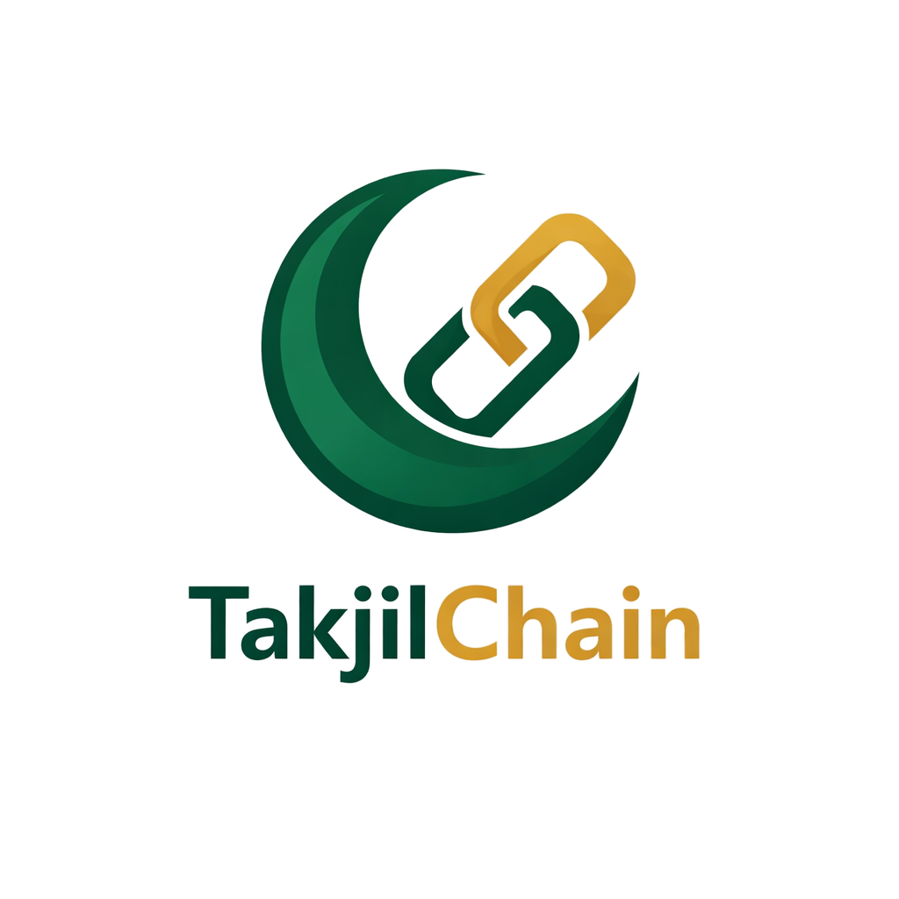

<div align="center">
  
  <h1>🌙 TakjilChain — AI-Driven Takjil Distribution Platform</h1>
</div>

**TakjilChain** adalah platform inovatif berbasis AI yang menghubungkan Donatur, Masjid, dan UMKM Kuliner untuk mendistribusikan sedekah takjil secara efisien, transparan, dan tepat sasaran. Dibangun untuk mempermudah ekosistem berbagi di bulan Ramadhan dengan sentuhan teknologi mutakhir.

---

## 🚀 Fitur Unggulan (Agentic System)

Platform ini menggunakan sistem **Multi-Agent AI** untuk menjalankan operasional secara otomatis:

- **🤖 Forecasting Agent**: Memberikan saran kuota takjil harian kepada pengurus masjid berdasarkan data historis, kapasitas masjid, dan tipe hari (Jumat/Lailatul Qadar).
- **🤖 Logistics Agent**: Melakukan _auto-rerouting_ pesanan. Jika UMKM tidak merespon dalam 30 menit, AI akan otomatis memindahkan pesanan ke UMKM terdekat berikutnya.
- **🤖 Reporting Agent**: Menghasilkan narasi laporan personal yang menyentuh hati bagi donatur menggunakan AI, merangkum dampak nyata dari sedekah mereka.
- **🛡️ AI Failover System**: Sistem "otak cadangan" bertingkat (Gemini → OpenRouter → Groq) untuk memastikan fitur AI tetap aktif 24/7.
- **📍 Smart Routing**: Algoritma pencarian UMKM terdekat berbasis koordinat GPS (Haversine Formula) untuk memastikan kesegaran takjil dan efisiensi pengantaran.

---

## 🛠️ Stack Teknologi

- **Framework**: [Next.js 15 (App Router)](https://nextjs.org/)
- **Runtime**: [Bun](https://bun.sh/)
- **Language**: TypeScript
- **Database ORM**: [Prisma](https://www.prisma.io/)
- **Database**: PostgreSQL (Hosted on Supabase)
- **Styling**: Tailwind CSS & Framer Motion
- **AI Engines**: Google Gemini (Primary), Claude via OpenRouter, Llama 3 via Groq
- **Payment Gateway**: [Mayar.id](https://mayar.id/) (Integrated with HMAC Signature Verification)
- **Icons**: Lucide React

---

## 📦 Instalasi & Persiapan

1. **Clone Repository**

   ```bash
   git clone https://github.com/IniRalfi/TakjilChain.git
   cd takjilchain
   ```

2. **Instal Dependensi**

   ```bash
   bun install
   ```

3. **Konfigurasi Environment**
   Buat file `.env` di root direktori dan isi variabel berikut:

   ```env
   DATABASE_URL="your_postgresql_url"

   # AI SECTIONS
   GEMINI_API_KEY="your_gemini_key"
   OPENROUTER_API_KEY="your_openrouter_key"
   GROQ_API_KEY="your_groq_key"

   # PAYMENT SECTION
   MAYAR_API_KEY="your_mayar_key"
   MAYAR_WEBHOOK_SECRET="your_webhook_secret"

   NEXT_PUBLIC_BASE_URL="http://localhost:3000"
   ```

4. **Setup Database**

   ```bash
   bunx prisma generate
   bunx prisma db push
   ```

5. **Jalankan Aplikasi**
   ```bash
   bun dev
   ```

---

## 🏗️ Arsitektur Data

Aplikasi ini memiliki 3 entitas utama:

- **Donatur**: Memilih masjid dan jumlah porsi yang ingin disedekahkan.
- **Masjid**: Mengelola kuota harian dan menerima kiriman takjil.
- **UMKM**: Menerima pesanan, memproduksi takjil, dan melakukan pengantaran.

Pencairan dana ke saldo UMKM dilakukan secara otomatis segera setelah pengurus masjid melakukan konfirmasi penerimaan di aplikasi.

---

## 🔐 Keamanan & Reliabilitas

- **Webhook Security**: Menggunakan verifikasi signature HMAC SHA256 untuk setiap notifikasi pembayaran dari Mayar.
- **Safe Prisma Wrapper**: Implementasi _retry mechanism_ untuk menangani kegagalan koneksi database (Cold Start) secara elegan.
- **Custom Toast System**: Sistem notifikasi kustom yang responsif untuk pengalaman pengguna yang lebih _premium_.

---

## 📝 Lisensi

Proyek ini dibangun untuk tujuan kompetisi dan pengembangan ekosistem kebaikan digital.

---

_Dibuat dengan ❤️ untuk menebar kebaikan di bulan suci._
